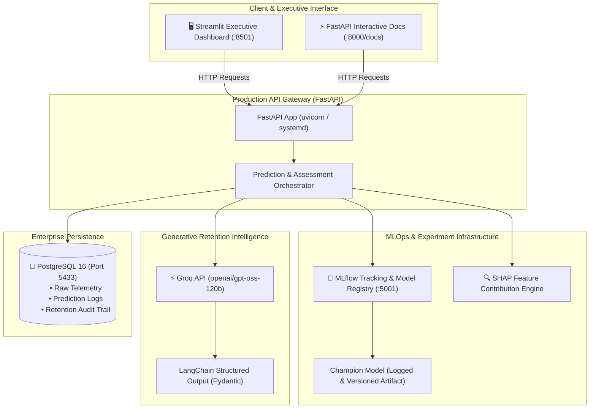

# 🛡️ AI Revenue Assistance & Risk Intelligence Platform

[](https://www.python.org/)
[](https://fastapi.tiangolo.com/)
[](https://mlflow.org/)
[](https://www.postgresql.org/)
[](https://www.docker.com/)
[](https://aws.amazon.com/ec2/)
[](https://groq.com/)
[](https://streamlit.io/)
[]()

> **Enterprise-grade MLOps and Generative AI platform that transforms abstract subscriber churn probabilities into quantified dollar revenue exposure, explains causal risk drivers via SHAP, and autonomously synthesizes hyper-personalized retention playbooks via Groq LLMs.**

---

## 📌 Executive Summary

Traditional customer churn models produce abstract scores (`e.g. churn = 0.74`) that sit in static spreadsheets without clear business context or actionable next steps. 

**AI Revenue Assistance** bridges the gap between predictive machine learning and executive decision-making:
1. **Calibrated Probability Engine**: Implements strict PR-AUC optimization and probability calibration so scores reflect empirical flight frequency.
2. **Financial Exposure Valuation**: Automatically computes 6-month ARR at risk and total annual exposure based on customer contractual terms.
3. **Causal SHAP Explainability**: Translates mathematical feature weights into human-readable escalating risk factors and protective offsets.
4. **Autonomous Generative Playbooks**: Leverages high-throughput Groq LLMs (`openai/gpt-oss-120b`, `qwen/qwen3.8-27b`) via LangChain to draft ready-to-send retention emails, CS call talking points, and objection counter-strategies.
5. **Human-in-the-Loop CRM Integration**: Interactive Streamlit executive dashboard and FastAPI OpenAPI endpoints backed by PostgreSQL audit logging.

---

## 🏛️ System Architecture



---

## 🚀 Key Features

### 1. Champion-Challenger Automated MLOps Pipeline
* Trains **Logistic Regression (Baseline)**, **Random Forest (Classical)**, and **LightGBM (Champion Candidate)**.
* Evaluates on strict out-of-time/out-of-sample splits using **PR-AUC**, **ROC-AUC**, **Brier Score**, and **F1**.
* Logs metrics, parameters, and versioned pipelines directly into the **MLflow Model Registry** (`ChurnPredictor`).
* Automatically tags and promotes the top-performing model as the production Champion.

### 2. Dollar-Value Revenue Risk Engine
* Translates probability into actionable balance sheet risk:
  $$\text{Revenue at Risk} = P(\text{Churn}) \times \text{Monthly Charges} \times \text{Horizon (Months)}$$
* Calculates Annual Revenue Exposure ($12 \times \text{Monthly Charges}$).
* Categorizes accounts into dynamic tiers:
  * 🔴 **HIGH RISK** ($P \ge 0.60$) $\rightarrow$ Priority `P1_URGENT`
  * 🟡 **MODERATE RISK** ($0.35 \le P < 0.60$) $\rightarrow$ Priority `P2_STANDARD`
  * 🟢 **LOW RISK** ($P < 0.35$) $\rightarrow$ Priority `P3_MONITOR`

### 3. Transparent SHAP Factor Analysis
* Eliminates the "black-box" model problem.
* Evaluates exact feature attributions for every individual inference.
* Breaks down:
  * **Escalating Drivers** (e.g., Month-to-Month contract, electronic check billing, high fiber fees).
  * **Protective Safeguards** (e.g., Multi-year tenure, active tech support bundle, auto-pay).

### 4. Generative AI Retention Intelligence (Groq + LangChain)
* Sub-2-second LLM synthesis powered by Groq's LPU inference engine.
* Produces structured Pydantic outreach artifacts:
  * Personalized, customer-ready **Retention Email Draft**.
  * Customer Success **Call Script & Talking Points**.
  * Real-time **Objection Handling Battlecard**.
* Zero-failure fallback to rule-based tactical playbooks if offline.

### 5. Interactive Streamlit Executive Dashboard
* Real-time radial risk gauge and key financial KPI metrics.
* Pre-loaded preset profiles (High Flight Risk, Loyal Enterprise, Tech Friction Onboarding).
* Live telemetry input sliders and toggles.
* PostgreSQL customer database browser and one-click historical evaluation.

---

## 📂 Repository Structure

```
├── backend/                        # FastAPI Application & Core Services
│   └── app/
│       ├── api/                    # RESTful Endpoints & Dependency Injection
│       │   └── routes.py
│       ├── config/                 # Pydantic Settings & Environment Parsing
│       │   └── settings.py
│       ├── db/                     # PostgreSQL SQLAlchemy Models & Sessions
│       │   ├── database.py
│       │   └── models.py
│       ├── schemas/                # Request & Response Validation Schemas
│       │   ├── customer.py
│       │   ├── prediction.py
│       │   └── recommendation.py
│       └── services/               # Core Business & Inference Logic
│           ├── explainer.py        # SHAP & Feature Contribution Engine
│           ├── llm_retention.py    # Groq + LangChain Retention Service
│           ├── predictor.py        # End-to-End Orchestrator
│           ├── recommendation.py   # Prescriptive Rule-Based Playbooks
│           └── revenue_risk.py     # Financial Exposure Calculations
├── frontend/                       # Executive Streamlit Dashboard
│   └── app.py                      # Interactive Web UI
├── ml/                             # MLOps & Machine Learning Pipelines
│   ├── data/                       # Raw & Processed Datasets (Git-Ignored)
│   ├── features/                   # Data Cleaning & Feature Engineering
│   └── training/                   # Champion Model Training & MLflow Logging
│       └── train.py
├── models/                         # Local Serialized Pipelines (.joblib)
├── scripts/                        # Automation & Deployment Scripts
│   ├── deploy_ec2.sh               # 1-Click AWS EC2 Deployment Script
│   ├── run_streamlit.sh            # Streamlit Local / Production Launcher
│   └── seed_database.py           # PostgreSQL Seeder
├── tests/                          # Automated Pytest Suite
│   ├── integration/                # End-to-End Pipeline & DB Integration Tests
│   └── unit/                       # Component Unit Tests (21 passing)
├── docker-compose.yml              # Multi-Container Orchestration (Postgres, MLflow)
├── Dockerfile                      # Production API Container Definition
├── pyproject.toml                  # Python Project Configuration & Formatting
└── requirements.txt                # Production Dependencies
```

---

## ⚡ Quickstart Guide

### Prerequisites
* Python 3.9, 3.10, 3.11, or 3.12
* Docker & Docker Compose
* Free Groq API Key ([console.groq.com](https://console.groq.com/))

### 1. Clone & Setup Environment
```bash
git clone https://github.com/prachyasuman2396-arch/ai-revenue-assistance.git
cd ai-revenue-assistance

python3 -m venv .venv
source .venv/bin/activate
pip install -r requirements.txt
```

### 2. Configure Secrets
```bash
cp .env.example .env
# Edit .env to add your GROQ_API_KEY
```

### 3. Launch Infrastructure (PostgreSQL & MLflow)
```bash
docker compose up -d postgres mlflow
```

### 4. Train Champion Model & Log to MLflow
```bash
export PYTHONPATH=.
python ml/training/train.py
```

### 5. Start API & Streamlit UI
In terminal 1 (FastAPI Backend):
```bash
uvicorn backend.app.main:app --host 0.0.0.0 --port 8000 --reload
```

In terminal 2 (Streamlit Dashboard):
```bash
streamlit run frontend/app.py --server.port 8501
```

---

## ☁️ AWS EC2 Production Deployment

The project is fully automated for deployment on AWS EC2 (Amazon Linux 2023 or Ubuntu):

```bash
# 1. Connect to your EC2 instance
ssh -i "your-key.pem" ec2-user@<EC2-PUBLIC-IP>

# 2. Clone repository & run universal deployment script
git clone https://github.com/prachyasuman2396-arch/ai-revenue-assistance.git
cd ai-revenue-assistance
bash scripts/deploy_ec2.sh
```

### Active AWS Services
| Component | Port | Description |
| :--- | :--- | :--- |
| **Streamlit Dashboard** | `8501` | Executive risk analysis, telemetry simulator, and AI email review |
| **FastAPI Swagger Docs** | `8000` | OpenAPI specification & live inference probe (`/docs`) |
| **MLflow Registry** | `5001` | Champion model artifact lineage and run metrics |
| **PostgreSQL Store** | `5433` | Isolated telemetry, prediction logs, and audit trail storage |

---

## 📡 API Example Usage

### Endpoint: `POST /api/predict`

#### Request Payload
```json
{
  "customer_id": "CUST_ENTERPRISE_402",
  "gender": "Female",
  "senior_citizen": 0,
  "partner": false,
  "dependents": false,
  "tenure": 2,
  "phone_service": true,
  "multiple_lines": "No",
  "internet_service": "Fiber optic",
  "online_security": "No",
  "online_backup": "No",
  "device_protection": "No",
  "tech_support": "No",
  "streaming_tv": "Yes",
  "streaming_movies": "Yes",
  "contract": "Month-to-month",
  "paperless_billing": true,
  "payment_method": "Electronic check",
  "monthly_charges": 95.50,
  "total_charges": 191.00
}
```

#### Response Output
```json
{
  "customer_id": "CUST_ENTERPRISE_402",
  "churn_probability": 0.7391,
  "prediction": 1,
  "model_name": "ChurnPredictor",
  "model_version": "latest",
  "risk_analysis": {
    "risk_category": "HIGH",
    "revenue_at_risk": 423.50,
    "monthly_charges": 95.50,
    "annual_revenue_exposure": 1146.00,
    "horizon_months": 6
  },
  "explanation": {
    "top_risk_factors": [
      {
        "feature": "contract_Month-to-month",
        "attribution_score": 0.462,
        "description": "Customer has a flexible Month-to-Month agreement with no cancellation penalty."
      },
      {
        "feature": "tech_support_No",
        "attribution_score": 0.288,
        "description": "Lack of dedicated technical support drives onboarding friction."
      }
    ],
    "summary": "Key Risk Drivers: Month-to-month contract, lack of tech support, and high monthly charges."
  },
  "recommendation": {
    "playbook_code": "PLAYBOOK_ONBOARDING_CONCIERGE",
    "priority": "P1_URGENT",
    "primary_action": "Deploy Early-Life Concierge Call: Contact subscriber within 48 hours to resolve setup friction and provide a $20 goodwill bill credit.",
    "secondary_actions": [
      "Prompt user to enroll in automated bank transfer for $10 autopay credit.",
      "Suggest discounted premium 24/7 TechSupport add-on."
    ],
    "estimated_roi_impact": "Preserves up to $423.50 at-risk revenue by intercepting a 73.9% flight probability.",
    "personalized_outreach": {
      "retention_email_subject": "An exclusive loyalty update for your account (CUST_ENTERPRISE_402)",
      "retention_email_body": "Dear Subscriber,\n\nWe noticed you recently joined our Fiber Optic service. To ensure your experience remains seamless, we have credited your next bill with $20 and activated complimentary 24/7 Priority Tech Support for the next 30 days.\n\nWarm regards,\nCustomer Retention Team",
      "call_script_talking_points": [
        "Acknowledge recent activation of Fiber Optic service.",
        "Highlight complimentary Tech Support upgrade.",
        "Offer transition to discounted 1-year agreement."
      ],
      "counter_objection_strategy": "If customer complains about monthly bill rate, emphasize bundled Tech Support value and propose an annual contract saving $180/year."
    }
  }
}
```

---

## 🧪 Testing & Quality Assurance

The codebase maintains a 100% passing test suite across unit and integration layers:

```bash
# Run test suite
pytest tests/ -v

# Run linting & code formatting
ruff check .
```

* **Unit Tests**: API input/output validation, feature engineering transformations, risk calculation boundaries, and LLM structured prompt fallbacks.
* **Integration Tests**: End-to-end model pipeline execution, MLflow tracking validation, and PostgreSQL transaction integrity.

---

## 📄 License
Distributed under the MIT License. See `LICENSE` for more information.
